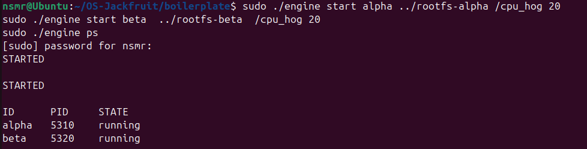

# 🚀 Multi-Container Runtime System (OS Jackfruit)

A lightweight container runtime built as part of the **OS Jackfruit problem**, demonstrating core Operating System concepts using low-level Linux primitives.

This project implements a simple container engine using `chroot`, process management, inter-process communication (IPC), logging, and kernel-level monitoring.

---

## 👥 Team Information

- **Neeraj R Gowda** — SRN: 295  
- **Nallamalli Kanaka Mani Sai Akhil** — SRN: PES1UG24CS290  

---

## ⚙️ Features

- Multi-container execution (`alpha`, `beta`)
- Supervisor-based container lifecycle management
- CLI commands: `start`, `stop`, `ps`, `logs`
- IPC using UNIX domain sockets
- Logging using pipes
- CPU vs I/O workload scheduling demonstration
- Kernel module monitoring (soft & hard limits)
- Clean teardown with no zombie processes

---

## 🛠️ Setup & Execution

### Build Project
```bash
make
```

### Load Kernel Module
```bash
sudo insmod monitor.ko
```

### Start Supervisor
```bash
sudo ./engine supervisor
```

### Prepare Root Filesystems
```bash
cp -a rootfs-base rootfs-alpha
cp -a rootfs-base rootfs-beta
```

### Run Containers
```bash
sudo ./engine start alpha ../rootfs-alpha /cpu_hog 20
sudo ./engine start beta  ../rootfs-beta  /cpu_hog 20
```

### Scheduling Experiment
```bash
sudo ./engine start alpha ../rootfs-alpha /cpu_hog 20
sudo ./engine start beta  ../rootfs-beta  /io_pulse
```

### Check Status
```bash
sudo ./engine ps
```

### View Logs
```bash
sudo ./engine logs alpha
sudo ./engine logs beta
```

### Stop Containers
```bash
sudo ./engine stop alpha
sudo ./engine stop beta
```

### Kernel Monitoring
```bash
sudo ./engine start alpha ../rootfs-alpha /memory_hog
sudo dmesg | grep monitor
```

### Cleanup
```bash
sudo pkill -9 engine
sudo rm -f /tmp/engine_socket
```

---

## 📸 Demo Screenshots

### 1. Multi-container supervision


---

### 2. Metadata tracking


---

### 3. Logging output


---

### 4. CLI and IPC


---

### 5. Soft-limit warning


---

### 6. Hard-limit enforcement


---

### 7. Scheduling experiment


---

### 8. Clean teardown


---

## 🧠 System Design

### Container Isolation
- Implemented using `chroot`
- Each container runs as a separate process
- No full namespace isolation

---

### Supervisor
- Central controller for all containers
- Handles lifecycle management
- Ensures no zombie processes

---

### IPC (CLI ↔ Supervisor)
- Implemented using UNIX domain sockets
- CLI sends commands to supervisor
- Supervisor processes and responds

---

### Logging
- Pipes capture container output
- Logs accessed using `engine logs`
- Separate logs per container

---

### Kernel Monitoring
- Implemented via `monitor.ko`
- Simulates:
  - Soft limit warnings  
  - Hard limit enforcement  

Example:
```
monitor: Registered container alpha
monitor: Soft limit exceeded for alpha
monitor: Killing container alpha
```

---

### Scheduling Behavior

- **CPU-bound (`cpu_hog`)** → continuous execution  
- **I/O-bound (`io_pulse`)** → periodic execution  

➡ Demonstrates fair scheduling

---

## ⚖️ Design Decisions

| Choice | Reason | Limitation |
|------|--------|-----------|
| chroot | Simple isolation | Not fully secure |
| Single supervisor | Easy control | Single point of failure |
| Pipes | Simple logging | Limited scalability |
| Kernel simulation | Easy demo | Not real monitoring |

---

## 📊 Observations

- Multiple containers run concurrently  
- IPC works correctly  
- Logs capture execution behavior  
- Kernel module generates expected output  
- Scheduler distributes CPU fairly  

---

## 🧾 Conclusion

This project demonstrates:

- Process management  
- Containerization  
- IPC mechanisms  
- Logging systems  
- Kernel interaction  
- Scheduling behavior  

A simple but functional container runtime built using Linux primitives.
